  <a href="https://kor1k1.github.io/KOR1K1/">
    <picture>
      <source media="(max-width: 600px)" srcset="./assets/city-mobile.svg" />
      
    </picture>
  </a>

 

I build backends for products where correctness matters:
auctions, payments, real-time flows and stateful systems.

**TypeScript · NestJS · PostgreSQL · Redis · Docker**  
Next.js when the product needs a frontend. Rust is the next frontier.

### First place, not a demo.

[CryptoBotContest](https://github.com/KOR1K1/CryptoBotContest) —
**1st place · $2,500** in CryptoBot Backend Contest #1.

An auction backend built around competitive bidding logic,
concurrency and correctness under pressure.

---

[Explore the city](https://kor1k1.github.io/KOR1K1/)
&nbsp; / &nbsp;
[Source](https://github.com/KOR1K1/KOR1K1/blob/main/scripts/build_city.py)
&nbsp; / &nbsp;
[GitHub](https://github.com/KOR1K1)
